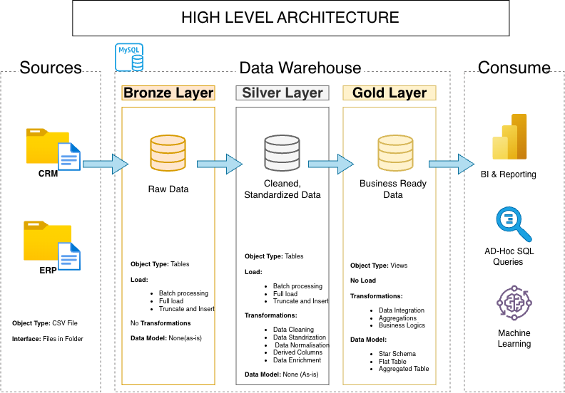
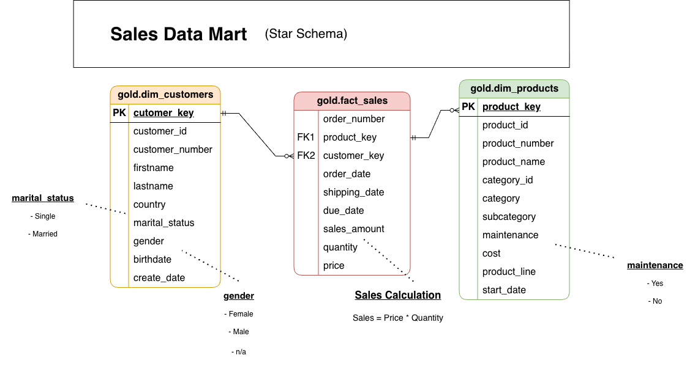

# MySQL Data Warehouse Project

## Overview

This project demonstrates the development of a **data warehouse using MySQL** and the **Medallion Architecture**.

CRM and ERP data is loaded from CSV files into a Bronze layer, cleaned and standardized in the Silver layer, and transformed into a business-ready **Star Schema** in the Gold layer.

The project demonstrates practical skills in:

- SQL
- Data Warehousing
- ETL / ELT
- Data Cleaning
- Data Integration
- Data Modeling
- Data Quality Testing
- Star Schema Design

---

## Data Architecture

The project follows three data layers:



### Bronze Layer
Stores raw CRM and ERP source data loaded from CSV files.

### Silver Layer
Contains cleaned and standardized data prepared for analytical use.

### Gold Layer
Contains business-ready analytical views organized into fact and dimension structures.

The Gold layer consists of:

- `gold.dim_customers`
- `gold.dim_products`
- `gold.fact_sales`

---

## Gold Layer Data Model

The Gold layer follows a **Star Schema**, with sales transactions connected to customer and product dimensions.



The dimension views provide descriptive business information, while `gold.fact_sales` contains measurable sales data such as sales amount, quantity, and price.

---

## Repository Structure

```text
sql-data-warehouse-project/
│
├── datasets/
│   ├── source_crm/
│   └── source_erp/
│
├── docs/
│   ├── data_architecture.png
│   ├── data_catalog.md
│   ├── data_flow.png
│   ├── data_model.png
│   ├── integration_model.png
│   └── naming_conventions.md
│
├── scripts/
│   ├── bronze/
│   │   ├── ddl_bronze.sql
│   │   └── load_data_bronze.sql
│   │
│   ├── silver/
│   │   ├── ddl_silver.sql
│   │   └── load_data_silver.sql
│   │
│   ├── gold/
│   │   └── ddl_gold.sql
│   │
│   └── init_database.sql
│
├── tests/
│   ├── quality_checks_gold.sql
│   └── quality_checks_silver.sql
│
├── LICENSE
└── README.md
```

---

## Data Flow

The complete warehouse flow is:

```text
CRM / ERP CSV Files
        ↓
     Bronze
        ↓
     Silver
        ↓
Silver Quality Checks
        ↓
      Gold
        ↓
Gold Quality Checks
        ↓
Analytics / Reporting
```

A detailed lineage diagram is available here:

[View Data Flow](docs/data_flow.png)

---
## Documentation

Additional technical documentation is available in the `docs` directory:

| Document | Description |
|---|---|
| [Data Architecture](docs/data_architecture.png) | Overall Bronze, Silver, and Gold architecture. |
| [Data Flow](docs/data_flow.png) | Data lineage across warehouse layers. |
| [Integration Model](docs/integration_model.png) | Integration of CRM and ERP source tables. |
| [Data Model](docs/data_model.png) | Gold-layer Star Schema. |
| [Data Catalog](docs/data_catalog.md) | Gold-layer column definitions and business descriptions. |
| [Naming Conventions](docs/naming_conventions.md) | Naming standards used throughout the project. |

---

## How to Run the Project

Execute the project in the following order:

1. Initialize the database:

```text
scripts/init_database.sql
```

2. Create Bronze tables:

```text
scripts/bronze/ddl_bronze.sql
```

3. Load the CSV files into the Bronze layer:

```text
scripts/bronze/load_data_bronze.sql
```

4. Create Silver tables:

```text
scripts/silver/ddl_silver.sql
```

5. Run the Silver loading script to create the `silver.load_silver` stored procedure:

```text
scripts/silver/load_data_silver.sql
```

6. Execute the Silver loading procedure:

```sql
CALL silver.load_silver();
```

7. Run Silver quality checks:

```text
tests/quality_checks_silver.sql
```

8. Create the Gold views:

```text
scripts/gold/ddl_gold.sql
```

9. Run Gold quality checks:

```text
tests/quality_checks_gold.sql
```

---

## Tools & Technologies

- MySQL Server 8
- MySQL Workbench
- SQL
- CSV
- Git & GitHub
- Draw.io

---

## Running on Another Machine

This project was developed for **MySQL**.

To run it on another machine:

1. Install MySQL Server and a compatible SQL client.
2. Clone or download the repository.
3. Update the CSV file paths in the Bronze loading script.
4. Ensure `LOAD DATA LOCAL INFILE` is enabled.
5. Run the scripts in the order listed above.

If another database platform is used, SQL syntax may need to be adapted for that system.

---
## Credits & Attribution

This project is inspired by the **Data Warehouse and Analytics Project** created by **DataWithBaraa**.

The original project was developed using **SQL Server**. This repository follows the same overall data warehouse approach while adapting the implementation to **MySQL**, including MySQL-specific loading methods, syntax, stored procedures, and transformations.

The **CRM and ERP datasets used in this project were obtained from the DataWithBaraa's project**.

The original project concept, datasets, instructional approach, and supporting source material are credited to the original author. This repository represents my MySQL-based implementation and documentation created while following and adapting that project.

**Original Project:** [https://github.com/DataWithBaraa/sql-data-warehouse-project?tab=readme-ov-file]


## License

This project is licensed under the [MIT License](LICENSE).

## About Me

I am a Business Analytics graduate with a background in Accounting and Finance. My work focuses on using data to understand business problems and support practical decision-making.

I have hands-on experience with SQL, Python, Excel, Power BI, Tableau, data warehousing, and ETL/ELT workflows. I am particularly interested in building reliable data foundations that make analysis more accurate and useful.

This project reflects that interest by giving me practical experience in designing a layered data warehouse, integrating data from different source systems, and preparing it for analytical use.

- **LinkedIn:** [linkedin.com/in/samanfiaz24](https://www.linkedin.com/in/samanfiaz24)
